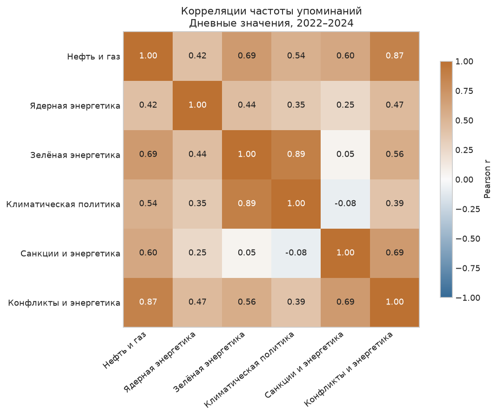

# Энергетика в новостях — GDELT, 2022–2024

**Лилия Ерофеевская · Python · анализ временных рядов**

Проведено исследование изменения частоты и тональности шести энергетических тем: нефти и газа, ядерной и зелёной энергетики, климатической политики, санкций и конфликтов. Сравниваю общую динамику и изменения около крупных событий.

## Посмотреть анализ

**[Основной ноутбук с графиками и выводами](notebooks/gdelt_energy_media_analysis.ipynb)**



## Что получилось

- Частота зелёной энергетики и климатической политики тесно связана: Pearson r = **0.89**. Для их тональности связь слабее: **0.30**.
- Вблизи 24 февраля 2022 года локальная модель выделяет рост конфликтного и санкционного счётчиков. Изменение санкционной тональности неубедительно.
- Вокруг COP наиболее заметный положительный коэффициент относится к первой неделе саммита: **+18.7%** при учёте прошлых значений, тренда и сезонности.
- H4 о предсказательной связи тональности и частоты остаётся открытой: VAR сохраняет зависимость в остатках, несмотря на небольшие p-value.

Это наблюдательные связи в готовой выгрузке, не причинные эффекты и не измерение общественного мнения.

## Данные и SQL

- [Дневные показатели](data/raw/gdelt_energy_daily.csv): 1 096 дней, 01.01.2022–31.12.2024; 13 колонок.
- [Географическая агрегация](data/raw/country_article_counts.csv): счётчики записей о локациях, не гарантированно уникальных статей.
- [SQL-скрипт](sql/gdelt_energy_unified.sql) 

Темы пересекаются, общего объёма новостей за день нет. Словари санкций и конфликтов требуют проверки по исходным текстам. Ноутбук работает локально с уже полученными данными — доступ к BigQuery не нужен.

## Как запустить

Python 3.11 или новее. Из корня проекта:

```powershell
python -m venv .venv
.\.venv\Scripts\Activate.ps1
python -m pip install -r requirements.txt
python -m pytest -q
python scripts/run_notebook.py
```

Последняя команда использует текущее Python-окружение, выполняет все ячейки и сохраняет результаты в ноутбуке. Графики и расчётные таблицы появляются в `reports/figures` и `reports/tables`. Исходные CSV не меняются.

Если меняется структура или текст ноутбука, редактировать нужно `scripts/build_notebook.py`, затем выполнить:

```powershell
python scripts/build_notebook.py
python scripts/run_notebook.py
```

Генерация заменяет ноутбук, поэтому правки напрямую в `.ipynb` сначала нужно перенести в скрипт.

## Структура

| Путь | Содержание |
|---|---|
| `notebooks/` | Основной анализ с сохранёнными результатами |
| `data/raw/` | Два рабочих CSV |
| `sql/` | SQL запрос |
| `src/` | Проверки, корреляции и модели H1–H4 |
| `scripts/` | Сборка и выполнение ноутбука |
| `tests/` | Проверки данных и расчётных функций |
| `reports/` | Источники дат, выбранные результаты и таблицы расчётов |
| `archive/` | Локальные архивы; в GitHub не публикуются |

## Проверка и ограничения

[Источники дат событий](reports/event_sources.md)

